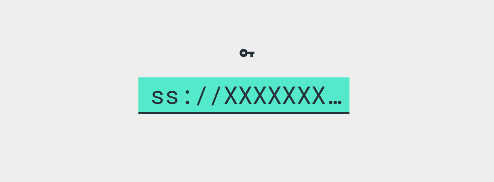
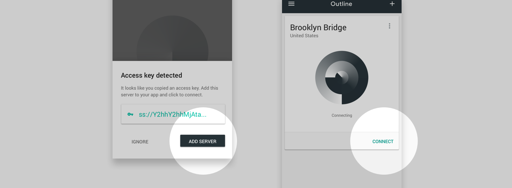

# Invitation instructions 

Have an invitation to connect to an Outline server? Follow these instructions to access to the open internet from your device. No personal information will be collected.

## 1. Copy your access code

`ss://xxx` located at the bottom of your invitation email or message. The Outline app will instantly add this server from your clipboard.

## 2. Install Outline

|Downloads|  |
| ------------- | ------------- |
| [Android](https://www.google.com) | If Google Play is not accessible, [get it here](https://www.google.com)  |
| [iOS](https://www.google.com) | Get it on the App Store |
| [Windows](https://www.google.com) | Download Outline.exe and double click to launch |
| [macOS](https://www.google.com) | Download outline.dmg, double click to install. Add Outline to your applications folder, double click to launch |
| Linux | See Linux set-up instructions below |

## 3. Add server and start connecting

Open the app and confirm your new server. Tap or click to connect. 
**Having trouble?** Try copying your access code again to add your server. 

## Linux set-up instructions
1.  [Get Outline for Linux](https://www.google.com). Download and install the latest version of the Shadowsocks client from GitHub.
2. Copy and paste the following command in your terminal.
`ss-local -s 162.243.222.47 -p 54114 -l <your_local_port> -k khVr8sW7RGHy] -m aes-256-cfb`
3. Update your browser settings. 
	* Use SOCKS5 proxy 
	* Configured at 127.0.0.1
	* On <your_local_port>
	* Click Connect to access the internet from your Outline server
