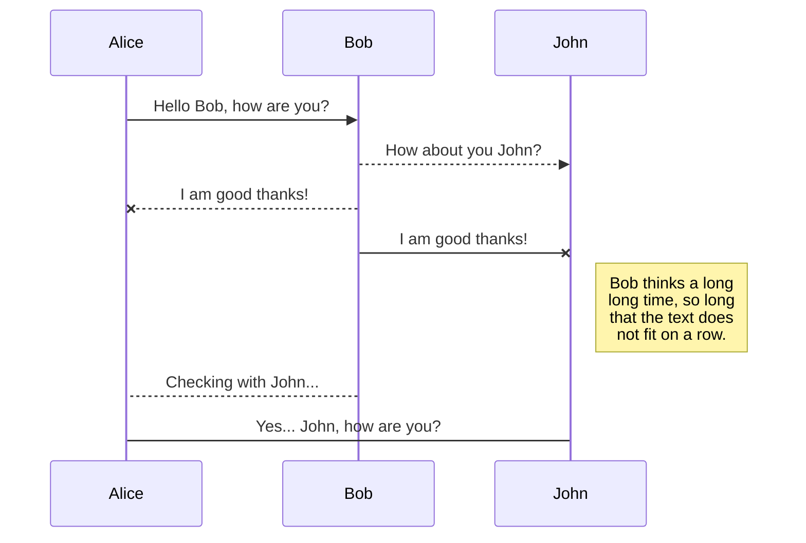
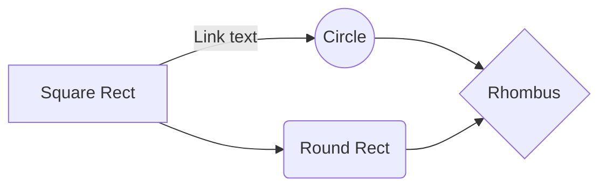

# Connect to an Outline server

### If your invitation link is blocked, follow these instructions to access to the open internet from this device. No personal information will be collected.

## Connect with an Android device

1. Copy the access code from your invitation. The Outline app will instantly add this server from your clipboard.
2.  [Get Outline from the Google Play Store](https://www.google.com). If Google Play is not accessible, [download the app manually](https://www.google.com).
3. Open the app and confirm your new server. Tap to connect.

> **Having trouble?** Copy your access code again (ss://xxx…) to add your server.

## Connect with an iOS device

1. Copy the access code from your invitation. The Outline app will instantly add this server from your clipboard.
2.  [Get Outline from the Google Play Store](https://www.google.com). If Google Play is not accessible, [download the app manually](https://www.google.com).
3. Open the app and confirm your new server. Tap to connect.

> **Having trouble?** Copy your access code again (ss://xxx…) to add your server.

## Connect with an iOS device

1. Copy the access code from your invitation. The Outline app will instantly add this server from your clipboard.
2.  [Get Outline from the Google Play Store](https://www.google.com). If Google Play is not accessible, [download the app manually](https://www.google.com).
3. Open the app and confirm your new server. Tap to connect.

## Connect with an iOS device

1. Copy the access code from your invitation. The Outline app will instantly add this server from your clipboard.
2.  [Get Outline from the Google Play Store](https://www.google.com). If Google Play is not accessible, [download the app manually](https://www.google.com).
3. Open the app and confirm your new server. Tap to connect.

## Connect with an iOS device

1. Copy the access code from your invitation. The Outline app will instantly add this server from your clipboard.
2.  [Get Outline from the Google Play Store](https://www.google.com). If Google Play is not accessible, [download the app manually](https://www.google.com).
3. Open the app and confirm your new server. Tap to connect.

> **Having trouble?** Copy your access code again (ss://xxx…) to add your server.

# Markdown extensions

StackEdit extends the standard Markdown syntax by adding extra **Markdown extensions**, providing you with some nice features.

> **ProTip:** You can disable any **Markdown extension** in the **File properties** dialog.

## SmartyPants

SmartyPants converts ASCII punctuation characters into "smart" typographic punctuation HTML entities. For example:

|                |ASCII                          |HTML                         |
|----------------|-------------------------------|-----------------------------|
|Single backticks|`'Isn't this fun?'`            |'Isn't this fun?'            |
|Quotes          |`"Isn't this fun?"`            |"Isn't this fun?"            |
|Dashes          |`-- is en-dash, --- is em-dash`|-- is en-dash, --- is em-dash|

## KaTeX

You can render LaTeX mathematical expressions using [KaTeX](https://khan.github.io/KaTeX/):

The *Gamma function* satisfying $\Gamma(n) = (n-1)!\quad\forall n\in\mathbb N$ is via the Euler integral

$$
\Gamma(z) = \int_0^\infty t^{z-1}e^{-t}dt\,.
$$

> You can find more information about **LaTeX** mathematical expressions [here](http://meta.math.stackexchange.com/questions/5020/mathjax-basic-tutorial-and-quick-reference).

## UML diagrams

You can render UML diagrams using [Mermaid](https://mermaidjs.github.io/). For example, this will produce a sequence diagram:

And this will produce a flow chart:

